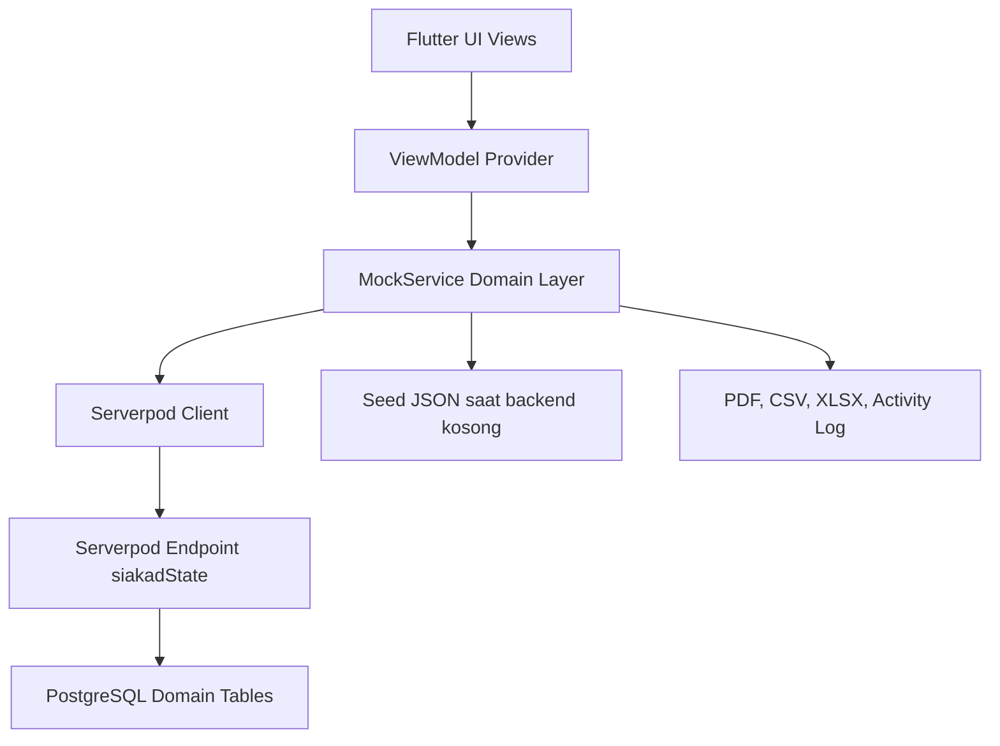

# Laporan Project Flutter SIAKAD Jeremy

Tanggal penyusunan: 8 Juli 2026

## 1. Ringkasan Project

Project `siakad_jeremy` adalah aplikasi Sistem Informasi Akademik (SIAKAD) berbasis Flutter dengan dukungan backend Serverpod dan PostgreSQL. Aplikasi ini dirancang sebagai sistem multi-role untuk mengelola data akademik kampus, mulai dari data master, KRS, nilai, tugas, presensi, kegiatan mahasiswa, hingga dashboard analitik pimpinan.

Aplikasi memakai pola Provider dan ViewModel untuk memisahkan UI dari logika domain. Lapisan domain berada di `MockService`, tetapi service ini tidak hanya menyimpan data lokal; data utama dibaca dan ditulis ke backend Serverpod melalui client `siakad_backend_client`. Pada saat backend kosong, aplikasi melakukan bootstrap dari seed data `assets/database/siakad_seed.json`.

## 2. Tujuan Aplikasi

Tujuan utama aplikasi ini adalah menyediakan satu sistem akademik terpadu untuk:

- Mengelola struktur akademik universitas, fakultas, program studi, mahasiswa, dosen, mata kuliah, ruangan, dan kelas kuliah.
- Mendukung proses KRS mahasiswa dari draft, pengajuan, validasi Dosen PA, sampai penolakan dengan catatan.
- Menyediakan presensi mahasiswa dan dosen berbasis pertemuan kuliah.
- Menyediakan input nilai detail berdasarkan komponen tugas, UTS, UAS, dan softskill.
- Memberikan akses role-based untuk admin, operator prodi, dosen, mahasiswa, dan pimpinan.
- Menyediakan rekap, grafik, dan dashboard untuk pengambilan keputusan akademik.

## 3. Teknologi dan Dependensi

Project utama memakai Flutter dan Dart SDK `^3.11.4`. Dependensi penting yang digunakan:

- `provider`: state management dan dependency injection ViewModel.
- `file_picker`: pemilihan file import dan bukti perubahan status mahasiswa.
- `excel`: pembacaan file XLSX untuk import akademik.
- `pdf` dan `printing`: pembuatan dan preview/cetak dokumen akademik.
- `siakad_backend_client`: client generated Serverpod untuk komunikasi dengan backend.

Backend berada pada folder `siakad_backend/siakad_backend_server` dan memakai:

- `serverpod 3.4.10`.
- `serverpod_auth_core_server` dan `serverpod_auth_idp_server`.
- PostgreSQL dan Redis melalui konfigurasi Serverpod.

## 4. Struktur Project

Struktur penting project:

- `lib/main.dart`: entry point aplikasi, inisialisasi `MockService`, Provider, tema terang/gelap, dan halaman awal.
- `lib/models/siakad_models.dart`: model domain utama seperti `User`, `Mahasiswa`, `Dosen`, `KRS`, `Nilai`, `Pertemuan`, `Presensi`, dan `ActivityLog`.
- `lib/services/mock_service.dart`: lapisan domain, validasi bisnis, sinkronisasi data, import/export CSV, dan persistence ke backend.
- `lib/services/pdf_service.dart`: pembuatan PDF KRS, KHS, dan rekap presensi kelas.
- `lib/viewmodels/`: ViewModel untuk auth, data master, KRS, nilai, kelas, ruangan, dan tema.
- `lib/views/`: halaman UI untuk login, role home, admin, dosen, mahasiswa, presensi, dan pimpinan.
- `lib/widgets/`: komponen UI reusable seperti scaffold, section card, menu tile, dan animasi.
- `assets/database/siakad_seed.json`: data awal demo.
- `assets/images/`: gambar pendukung dashboard dan login.
- `siakad_backend/`: workspace Serverpod, client generated, server, migration, dan test backend.
- `test/`: unit test Flutter.
- `tool/`: script seed, resync, generate dataset besar, dan pemeriksaan state backend.

## 5. Arsitektur Aplikasi

Arsitektur aplikasi dapat diringkas sebagai berikut:



Penjelasan lapisan:

- UI membaca data dari ViewModel dan memanggil aksi seperti tambah data, ambil KRS, input nilai, atau simpan presensi.
- ViewModel meneruskan aksi ke `MockService` dan menyimpan pesan sukses/error melalui `BaseListViewModel`.
- `MockService` menjalankan validasi domain, memperbarui list lokal, membuat activity log, lalu menyimpan delta perubahan ke backend.
- Backend `siakadState` menyimpan state JSON dan menjaga proyeksi tabel relasional PostgreSQL.

## 6. Sistem Role dan Hak Akses

Aplikasi memiliki role utama:

- `Admin Universitas`
- `Admin Fakultas`
- `Operator Prodi`
- `Dosen`
- `Mahasiswa`
- `Pimpinan`

Role pimpinan memiliki tingkat:

- `Rektor`
- `Dekan`
- `Koordinator Program Studi`

Routing multi-role diatur di `RoleHomeView`. Setiap role mendapatkan tab dan halaman yang berbeda. `scopeId` pada user membatasi data yang dilihat, misalnya NIM untuk mahasiswa, NIDN untuk dosen, id prodi untuk operator prodi, dan id fakultas untuk admin fakultas/dekan.

## 7. Fitur Autentikasi dan Sesi

Fitur autentikasi yang tersedia:

- Login berbasis username dan password.
- Login admin dari tabel user internal.
- Login mahasiswa memakai NIM atau nama mahasiswa.
- Login dosen memakai NIDN atau nama dosen.
- Role-based routing setelah login.
- Logout dan pembersihan sesi.
- Pencatatan aktivitas login dan logout ke `activity_log`.
- Kartu akun demo pada halaman login untuk memudahkan pengujian.

Catatan: password pada data demo masih disimpan sebagai teks biasa untuk kebutuhan simulasi. Untuk produksi, password perlu di-hash dan endpoint backend perlu diberi role guard.

## 8. Fitur Admin Universitas

Admin Universitas memiliki cakupan global. Fitur yang tersedia:

- Dashboard ringkasan universitas.
- KPI mahasiswa aktif, dosen, kelas dibuka, dan KRS disetujui.
- Monitoring beban fakultas dan sinyal operasional.
- Quick action ke Data Global dan Kelola User.
- Mengelola fakultas.
- Menambah fakultas sekaligus membuat akun Admin Fakultas.
- Melihat Data Global berisi statistik master data.
- Mengelola fase KRS universitas.
- Memulai fase KRS dengan tanggal mulai dan batas akhir.
- Mengakhiri fase KRS aktif.
- Melihat activity log terbaru.
- Export template dan data akademik.
- Import CSV/XLSX untuk mahasiswa, dosen, mata kuliah, dan nilai.
- Mengelola user sesuai scope universitas.

## 9. Fitur Admin Fakultas

Admin Fakultas bekerja pada scope satu fakultas. Fitur yang tersedia:

- Dashboard role untuk melihat alur kerja fakultas.
- Mengelola program studi dalam fakultasnya.
- Menambah program studi sekaligus membuat akun Operator Prodi.
- Mengubah dan menghapus program studi dengan validasi relasi.
- Melihat data dalam scope fakultas.
- Mengelola user yang berada dalam cakupan fakultas.
- Melihat profil dan logout.

## 10. Fitur Operator Prodi

Operator Prodi memiliki fitur operasional paling lengkap untuk data akademik prodi:

- Dashboard prodi dengan statistik mahasiswa aktif, dosen, mata kuliah, ruangan, dan kelas kuliah.
- Kelola mahasiswa:
  - tambah mahasiswa,
  - ubah data mahasiswa,
  - hapus mahasiswa jika belum memiliki KRS aktif,
  - pencarian, sorting, dan pagination.
- Kelola status mahasiswa:
  - ubah status Aktif, Cuti, Nonaktif, Lulus, atau Drop Out,
  - wajib upload bukti perubahan status,
  - validasi bukti maksimal 5 MB,
  - format bukti dibatasi PDF, JPG, JPEG, atau PNG,
  - riwayat status tersimpan.
- Kelola dosen:
  - tambah dosen,
  - ubah data dosen,
  - hapus dosen jika tidak menjadi pengampu kelas aktif.
- Kelola mata kuliah:
  - tambah mata kuliah,
  - ubah mata kuliah,
  - hapus mata kuliah jika belum dipakai kelas,
  - kategori mata kuliah Reguler, Praktikum, dan Case Method,
  - pengaturan bobot nilai tugas, UTS, UAS, dan softskill.
- Kelola ruangan:
  - tambah ruangan,
  - ubah ruangan,
  - hapus ruangan jika tidak dipakai kelas,
  - validasi kapasitas ruangan.
- Kelola kelas kuliah:
  - buka kelas,
  - pilih mata kuliah,
  - pilih satu atau lebih dosen pengajar,
  - dosen pertama menjadi Dosen Utama,
  - dosen berikutnya menjadi Dosen Pendamping,
  - atur kapasitas, hari, jam, ruangan,
  - update kelas,
  - hapus kelas jika belum memiliki peserta KRS.
- User Prodi:
  - melihat user yang terkait dengan prodi,
  - menambah admin sesuai aturan scope.

## 11. Fitur Mahasiswa

Mahasiswa mendapatkan halaman akademik pribadi. Fitur yang tersedia:

- Dashboard mahasiswa:
  - ringkasan KRS, SKS, nilai, presensi, tugas, dan agenda,
  - quick action ke KRS, Jadwal, Nilai, dan Kegiatan,
  - agenda hari ini,
  - tugas terdekat,
  - grafik progres IPK,
  - performa akademik.
- KRS:
  - melihat daftar kelas tersedia sesuai prodi,
  - mengambil kelas sebagai draft KRS,
  - menghapus KRS draft,
  - mengajukan KRS ke Dosen PA,
  - melihat status draft, diajukan, disetujui, atau ditolak,
  - melihat catatan Dosen PA ketika KRS ditolak,
  - cetak KRS ke PDF.
- Jadwal kuliah:
  - melihat jadwal berdasarkan KRS yang diambil,
  - filter hari,
  - informasi dosen, ruangan, jam, dan mata kuliah.
- Nilai:
  - melihat nilai per semester,
  - komponen nilai tugas, UTS, UAS, softskill, final, dan huruf,
  - ringkasan IPK/SKS,
  - cetak KHS ke PDF.
- Kegiatan:
  - pengajuan skripsi,
  - pengajuan magang,
  - pengajuan KKN,
  - status pengajuan kegiatan.
- Presensi:
  - melihat pertemuan yang sedang dibuka,
  - mengisi presensi sendiri saat pertemuan berlangsung,
  - melihat riwayat presensi,
  - melihat persentase kehadiran.
- Profil:
  - melihat data pribadi, akademik, dan kontak,
  - mengubah kontak dan data profil tertentu,
  - logout.

## 12. Fitur Dosen

Dosen memiliki fitur untuk pengajaran, KRS, nilai, presensi, tugas, dan bimbingan:

- Dashboard dosen:
  - statistik kelas, mahasiswa, tugas, KRS menunggu, dan bimbingan,
  - quick action ke kelas/presensi, input nilai, validasi KRS, tugas, dan bimbingan,
  - jadwal perkuliahan,
  - deadline tugas.
- Kelas Saya:
  - melihat kelas yang diampu,
  - melihat peserta kelas,
  - membuka daftar pertemuan kelas,
  - mengelola status pertemuan.
- Pertemuan dan Presensi:
  - mulai pertemuan dengan materi,
  - isi presensi mahasiswa per peserta,
  - isi presensi dosen dengan status Hadir, Izin, Sakit, atau Alfa,
  - selesaikan pertemuan,
  - cetak rekap presensi kelas ke PDF.
- Input nilai:
  - memilih kelas yang diampu,
  - input nilai mahasiswa,
  - komponen tugas, UTS, UAS, softskill,
  - nilai akhir dihitung menggunakan bobot mata kuliah,
  - nilai huruf dihitung otomatis dari nilai akhir.
- Validasi KRS:
  - melihat KRS mahasiswa bimbingan,
  - menyetujui KRS,
  - menolak KRS dengan catatan wajib,
  - validasi hanya boleh dilakukan oleh Dosen PA mahasiswa tersebut.
- Tugas:
  - membuat tugas baru untuk kelas yang diampu,
  - mengatur judul, deskripsi, kelas, dan deadline,
  - melihat daftar tugas aktif.
- Bimbingan skripsi:
  - melihat pengajuan skripsi mahasiswa bimbingan,
  - menyetujui skripsi,
  - menambahkan catatan bimbingan.
- Profil:
  - melihat data akademik dan kontak dosen,
  - mengubah email, nomor HP, alamat, dan keahlian,
  - logout.

## 13. Fitur Pimpinan

Role pimpinan bersifat read-only untuk monitoring dan laporan. Aplikasi membedakan tampilan pimpinan berdasarkan tingkat jabatan.

### 13.1 Rektor

Fitur Rektor:

- Dashboard Rektor atau command center universitas.
- Health score gabungan dari KRS, presensi mahasiswa, presensi dosen, kapasitas kelas, dan utilisasi ruangan.
- Filter analitik berdasarkan tahun ajaran, semester, fakultas, prodi, status KRS, dan status presensi.
- KPI eksekutif universitas.
- Radar kinerja KRS, presensi mahasiswa, presensi dosen, dan kapasitas.
- Prioritas hari ini, termasuk KRS menunggu validasi dan isu presensi.
- Data Universitas:
  - data mahasiswa,
  - data dosen,
  - mata kuliah,
  - kelas kuliah,
  - ruang kelas.
- Monitoring KRS Universitas.
- Monitoring Presensi.
- Laporan Akademik Rektor.
- Perbandingan fakultas dengan tabel dan grafik.

### 13.2 Dekan

Fitur Dekan:

- Dashboard Fakultas.
- KPI akademik fakultas.
- Monitoring kelas dalam cakupan fakultas.
- Monitoring KRS fakultas.
- Monitoring presensi mahasiswa dan dosen.
- Laporan Fakultas.
- Grafik KRS, presensi mahasiswa, dan presensi dosen.
- Warning/alert seperti mahasiswa belum KRS, dosen belum presensi, dan mata kuliah dengan presensi rendah.

### 13.3 Koordinator Program Studi

Fitur Korpro:

- Dashboard Prodi.
- Health score prodi dari presensi, IPK, KRS, dan progress pertemuan.
- KPI mahasiswa aktif, dosen, rata-rata presensi, KRS disetujui, dan kelas aktif.
- Mahasiswa prioritas berdasarkan risiko akademik.
- Kelas yang perlu diikuti.
- View Mahasiswa Prodi:
  - filter,
  - sorting berdasarkan nama, semester, IPK, presensi, dan SKS,
  - pagination,
  - detail status, IPK, presensi, dan riwayat status.
- View Dosen Prodi:
  - filter dan sorting,
  - beban SKS,
  - jumlah kelas,
  - presensi,
  - bimbingan skripsi.
- Jadwal Kuliah Prodi:
  - timeline jadwal,
  - analitik beban,
  - risiko dan konflik jadwal.
- Overview Presensi:
  - KPI presensi,
  - gauge,
  - distribusi status,
  - heatmap presensi,
  - daftar kelas atau mahasiswa yang perlu perhatian.

## 14. Fitur KRS dan Validasi Akademik

KRS adalah salah satu fitur utama. Aturan bisnis yang diterapkan:

- KRS hanya dapat diambil saat fase KRS aktif.
- Mahasiswa hanya dapat mengambil kelas dari prodi yang sama.
- Kelas tidak boleh penuh.
- Kelas yang sama tidak boleh masuk dua kali pada semester yang sama.
- Jadwal kelas tidak boleh bentrok dengan KRS yang sudah dipilih.
- Total SKS maksimal 24.
- KRS yang sudah diajukan atau disetujui tidak dapat diubah.
- Pengajuan KRS harus memiliki minimal satu kelas.
- Dosen PA dapat menyetujui semua item KRS semester yang diajukan.
- Dosen PA dapat menolak KRS dengan catatan wajib.
- KRS disimpan dengan status `draft`, `diajukan`, `disetujui`, atau `ditolak`.

## 15. Fitur Nilai

Fitur nilai mendukung input dan rekap nilai mahasiswa:

- Nilai dapat difilter berdasarkan mahasiswa dan kelas.
- Dosen hanya bisa menginput nilai untuk kelas yang diajar.
- Komponen nilai meliputi tugas, UTS, UAS, dan softskill.
- Bobot nilai disimpan pada mata kuliah.
- Total bobot wajib 100%.
- Nilai akhir dihitung dari komponen berbobot.
- Nilai huruf otomatis:
  - A untuk nilai 85 ke atas,
  - B+ untuk nilai 75 sampai 84,
  - B untuk nilai 65 sampai 74,
  - C untuk nilai 55 sampai 64,
  - D untuk nilai di bawah 55.
- Mahasiswa dapat melihat detail nilai dan mencetak KHS.
- Pimpinan dapat melihat rekap nilai dalam dashboard dan laporan.

## 16. Fitur Presensi

Presensi dibuat berbasis kelas dan pertemuan:

- Setiap kelas baru otomatis dibuatkan 16 slot pertemuan.
- Pertemuan memiliki status `belumDimulai`, `berlangsung`, dan `selesai`.
- Dosen dapat memulai pertemuan dengan materi.
- Mahasiswa hanya dapat presensi saat pertemuan berlangsung.
- Mahasiswa hanya dapat presensi jika KRS pada kelas tersebut sudah disetujui.
- Mahasiswa tidak dapat presensi dua kali pada pertemuan yang sama.
- Dosen dapat menyimpan presensi mahasiswa per peserta.
- Dosen dapat mengisi presensi dirinya sendiri dengan status Hadir, Izin, Sakit, atau Alfa.
- Presensi dosen tidak dapat diisi dua kali untuk pertemuan yang sama.
- Dosen dapat menyelesaikan pertemuan.
- Rekap presensi kelas dapat dicetak ke PDF.
- Pimpinan melihat rekap presensi dalam grafik, heatmap, dan tabel monitoring.

## 17. Fitur Import, Export, dan Dokumen

Fitur data akademik:

- Export template CSV untuk mahasiswa, dosen, mata kuliah, dan nilai.
- Export data CSV untuk mahasiswa, dosen, mata kuliah, dan nilai.
- Import CSV/XLSX untuk mahasiswa, dosen, mata kuliah, dan nilai.
- Hasil import menampilkan jumlah data dibuat, diperbarui, dilewati, dan error.
- Import mencatat activity log.

Fitur dokumen PDF:

- Cetak KRS mahasiswa.
- Cetak KHS mahasiswa.
- Cetak rekap presensi kelas.
- Pada Windows, PDF dibuka dalam halaman preview memakai `PdfPreview`.
- Platform lain memakai `Printing.layoutPdf`.

## 18. Fitur Activity Log

Activity log menyimpan catatan aktivitas penting:

- Login.
- Logout.
- Import data.
- CRUD data akademik.
- Perubahan KRS.
- Nilai.
- Presensi.
- Aktivitas lain yang memanggil `recordActivity` atau `_saved`.

Data log ditampilkan pada halaman Data Global dan disimpan pada tabel `activity_log`.

## 19. Backend dan Persistence

Backend Serverpod menyediakan endpoint `siakadState` dengan operasi:

- `getState`
- `saveState`
- `listRows`
- `getRow`
- `upsertRow`
- `applyRowChanges`
- `deleteRow`

Strategi persistence:

- Saat aplikasi pertama kali berjalan, `MockService.create()` mengambil state dari backend.
- Jika state kosong, aplikasi memuat seed JSON, membuat default pertemuan, lalu menyimpan state awal.
- Jika state sudah ada, aplikasi memuat state backend dan memastikan default fitur tetap tersedia.
- Perubahan normal disimpan sebagai delta per baris melalui `applyRowChanges`.
- Full-state save dipakai untuk bootstrap awal atau proses resync eksplisit.
- Backend menjaga state JSON dan tabel relasional secara bersamaan.

Tabel domain utama:

- `siakad_users`
- `fakultas`
- `prodi`
- `tahun_ajaran`
- `fase_krs`
- `mahasiswa`
- `riwayat_status_mahasiswa`
- `dosen`
- `mata_kuliah`
- `ruangan`
- `kelas`
- `dosen_pengajar`
- `krs`
- `nilai`
- `tugas`
- `skripsi`
- `magang`
- `kkn`
- `pertemuan`
- `presensi`
- `presensi_dosen`
- `activity_log`

Migration Serverpod membuat tabel, index, foreign key, dan kolom tambahan seperti kategori/bobot mata kuliah serta activity log.

## 20. Data Seed dan Dataset Demo

Data awal berada di `assets/database/siakad_seed.json`. Seed berisi:

- user admin dan pimpinan,
- fakultas,
- program studi,
- tahun ajaran,
- mahasiswa,
- dosen,
- mata kuliah,
- ruangan,
- kelas,
- dosen pengajar,
- KRS,
- nilai,
- tugas,
- presensi dan kegiatan awal.

Project juga memiliki script `tool/generate_bulk_siakad_data.py` untuk membuat dataset besar berisi ribuan data demo akademik.

## 21. UI dan Pengalaman Pengguna

Karakter UI:

- Menggunakan Material 3.
- Tema terang dan tema gelap.
- Skema warna biru dan kuning.
- Background visual khusus.
- Dashboard memakai gambar dari `assets/images`.
- `AppScaffold` membuat layout responsif untuk mobile dan desktop.
- Bottom navigation disesuaikan role.
- Desktop memiliki top bar tersendiri.
- `AnimatedEntrance` memberikan animasi masuk pada komponen, tetapi dinonaktifkan pada web atau saat reduce motion aktif.
- Komponen reusable seperti `SectionCard`, `MenuTile`, dan `InfoTile`.

## 22. Pengujian

Test yang tersedia:

- `test/siakad_models_test.dart`: memastikan label role stabil untuk routing login.
- `test/dashboard_cache_key_test.dart`: memastikan cache key dashboard berubah saat revision atau filter berubah.
- Backend memiliki integration test untuk endpoint greeting dan state SIAKAD.

Perintah quality check:

```powershell
flutter test
flutter analyze
```

Backend test membutuhkan PostgreSQL test sesuai konfigurasi Serverpod.

## 23. Cara Menjalankan Project

Menjalankan backend:

```powershell
cd siakad_backend\siakad_backend_server
docker compose up -d postgres redis
dart bin\main.dart --apply-migrations
```

Menjalankan Flutter:

```powershell
flutter pub get
flutter run -d windows --dart-define=SIAKAD_API_URL=http://localhost:8080/
```

Seed ulang backend:

```powershell
dart run tool\seed_backend.dart
```

Resync tabel relasional dari state:

```powershell
dart run tool\resync_backend_tables.dart
```

## 24. Kelebihan Project

Kelebihan utama project:

- Sudah mendukung banyak role akademik.
- Fitur akademik utama cukup lengkap: master data, KRS, nilai, presensi, tugas, kegiatan, laporan, dan dashboard pimpinan.
- Validasi bisnis KRS cukup detail.
- Kelas otomatis memiliki 16 pertemuan.
- Nilai berbobot berdasarkan konfigurasi mata kuliah.
- Import/export data sudah tersedia.
- Cetak dokumen akademik ke PDF.
- Persistence sudah tersambung ke Serverpod dan PostgreSQL.
- Perubahan normal memakai delta row, sehingga lebih aman dibanding selalu menyimpan full snapshot.
- Dashboard pimpinan memiliki filter, grafik, dan ringkasan operasional.

## 25. Batasan dan Rekomendasi Lanjutan

Batasan saat ini:

- Auth aplikasi utama masih berbasis data demo dan password plaintext.
- Backend belum menerapkan role guard per endpoint domain.
- Conflict handling row yang sama belum memakai optimistic concurrency.
- UI belum menampilkan status pending/error persistence dari `lastPersistenceError`.
- Sebagian besar validasi bisnis masih berada di service frontend/domain, belum dipindahkan ke endpoint backend typed.

Rekomendasi lanjutan:

- Tambahkan hashing password dan manajemen user produksi.
- Tambahkan role guard dan scope guard di backend.
- Tambahkan kolom `version` atau `updatedAt` untuk optimistic concurrency.
- Tampilkan banner status sinkronisasi di UI.
- Pisahkan endpoint typed untuk operasi penting seperti KRS, nilai, presensi, dan perubahan status mahasiswa.
- Tambahkan test untuk validasi KRS, input nilai, presensi, import/export, dan activity log.
- Tambahkan audit trail yang lebih rinci untuk perubahan data kritis.

## 26. Kesimpulan

Project Flutter SIAKAD Jeremy sudah membentuk aplikasi akademik multi-role yang lengkap untuk simulasi dan pengelolaan data kampus. Fitur yang tersedia mencakup administrasi akademik, KRS, nilai, tugas, presensi, kegiatan mahasiswa, import/export, cetak dokumen, activity log, serta dashboard pimpinan dari level prodi sampai universitas.

Secara teknis, project sudah memiliki pemisahan UI, ViewModel, domain service, backend client, dan persistence Serverpod/PostgreSQL. Dengan penguatan auth, role guard backend, optimistic concurrency, dan perluasan test, project ini dapat dikembangkan menjadi sistem akademik yang lebih siap untuk penggunaan multi-user nyata.
